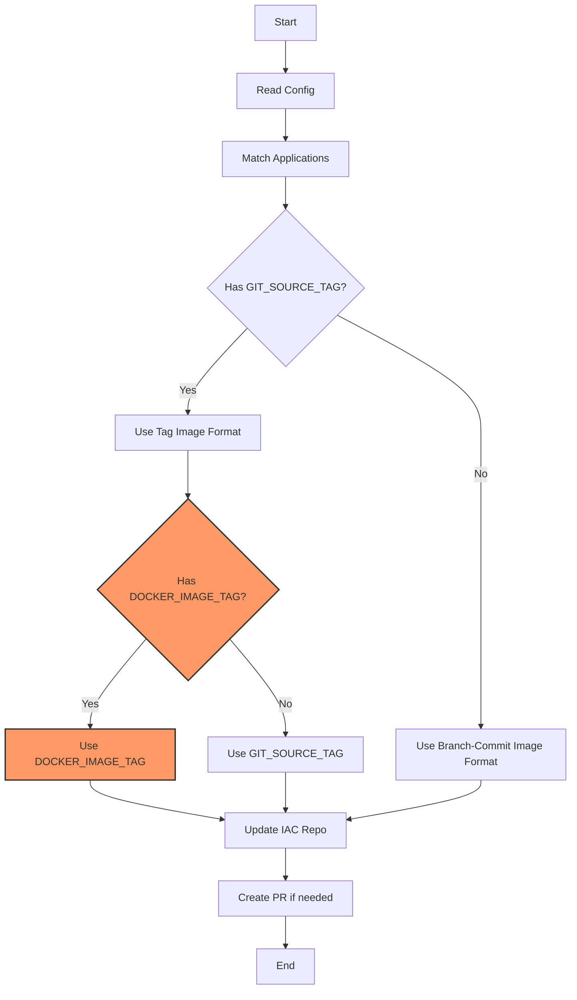

# CDK8S Image Updater Refactoring Plan

## Current Architecture Analysis

The CDK8S Image Updater tool is used to update Docker image references in a CDK8S Infrastructure as Code repository based on an application's source repository/branch.

### Key Components

1. **Configuration Processing**
   - Reads `applications*.yaml` files from IAC repo
   - Supports environment-specific configurations
   - Uses ERB templating for dynamic image tag generation

2. **Application Matching Logic**
   - Matches based on:
     - Repository (git_repo == GIT_SOURCE_REPO)
     - Branch match OR only_tags flag
     - Tag presence for only_tags=true configurations

3. **Image Tag Handling**
   - Development: Uses branch-commit format
   - Production: Uses git tag format

### Current Flow



## Required Changes

### 1. Impact Analysis

Current `GIT_SOURCE_TAG` usage points:
- Application matching with only_tags=true flag
- PR branch name generation
- PR creation decision logic
- Image tag template in applications*.yaml

### 2. Required Modifications

#### a. Image Template Logic

Current production template:
```yaml
image: "<%= \"org/backend-auth:#{ENV['GIT_SOURCE_TAG'].to_s.gsub(/\/+/, '-')}\" %>"
```

New template format:
```yaml
image: "<%= \"org/backend-auth:#{ENV['DOCKER_IMAGE_TAG'] || ENV['GIT_SOURCE_TAG'].to_s.gsub(/\/+/, '-')}\" %>"
```

#### b. Unchanged Components
The following components will remain unchanged:
- Application matching logic (still uses GIT_SOURCE_TAG)
- PR creation logic (still uses GIT_SOURCE_TAG)
- Branch naming (still includes GIT_SOURCE_TAG)

### 3. Testing Strategy

Currently, the project lacks automated tests. We need to:

1. **Set Up Testing Framework**
   - Add RSpec as the testing framework (based on .gitignore suggesting previous RSpec usage)
   - Set up test environment and configuration
   - Create fixtures for YAML configurations

2. **Test Coverage Plan**
   a. **Unit Tests**
      - UpdaterUtilities module
        - Test application matching logic
        - Test tag handling
      - UpdaterController class
        - Test configuration parsing
        - Test image tag generation
        - Test PR creation logic
   
   b. **Integration Tests**
      - Full workflow tests with different scenarios:
        - Development deployments (branch + commit)
        - Production deployments (tag only)
        - Production deployments (tag + docker image)
      - Error cases and edge conditions

3. **Test Scenarios**
   1. **Existing Functionality**
      - Deploy with GIT_SOURCE_TAG only
      - Verify tag format in generated image name
      - Verify PR creation behavior

   2. **New Functionality**
      - Deploy with both GIT_SOURCE_TAG and DOCKER_IMAGE_TAG
      - Verify DOCKER_IMAGE_TAG takes precedence
      - Verify PR creation still works as expected

   3. **Error Cases**
      - Invalid DOCKER_IMAGE_TAG format
      - Missing GIT_SOURCE_TAG with DOCKER_IMAGE_TAG
      - Invalid combinations of environment variables

### 4. Implementation Steps

1. **Test Infrastructure (New)**
   - Add RSpec to Gemfile
   - Set up spec directory structure
   - Create test helper and configuration
   - Add fixtures for test data

2. **Documentation Updates**
   - Add DOCKER_IMAGE_TAG to README.md
   - Document new behavior and variable precedence
   - Update example configurations
   - Add testing documentation

3. **Code Changes**
   - Modify application configuration processing
   - Add DOCKER_IMAGE_TAG validation if needed
   - Update example templates
   - Add unit tests for each change

4. **Testing**
   - Write unit tests first (TDD approach)
   - Add integration tests
   - Verify backward compatibility
   - Test error handling

## Next Steps

1. Review and approve plan
2. Set up testing infrastructure
3. Update documentation
4. Implement code changes with tests
5. Perform end-to-end testing
6. Create PR with changes

## Testing Setup Details (New)

```ruby
# Gemfile additions
group :development, :test do
  gem 'rspec', '~> 3.12'
  gem 'rspec-its'
  gem 'simplecov'
  gem 'faker'
end

# Example test structure
spec/
├── spec_helper.rb
├── fixtures/
│   ├── applications.yaml
│   └── applications_protected.yaml
├── unit/
│   ├── utilities/
│   │   └── updater_utilities_spec.rb
│   └── controllers/
│       └── updater_controller_spec.rb
└── integration/
    └── update_workflow_spec.rb
